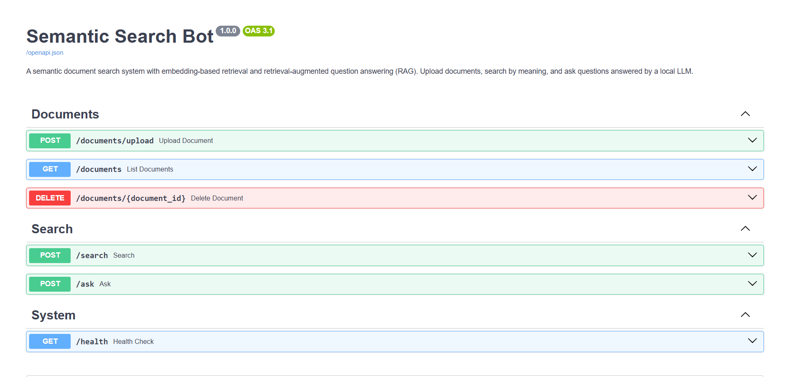
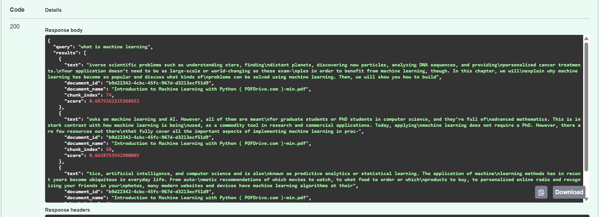
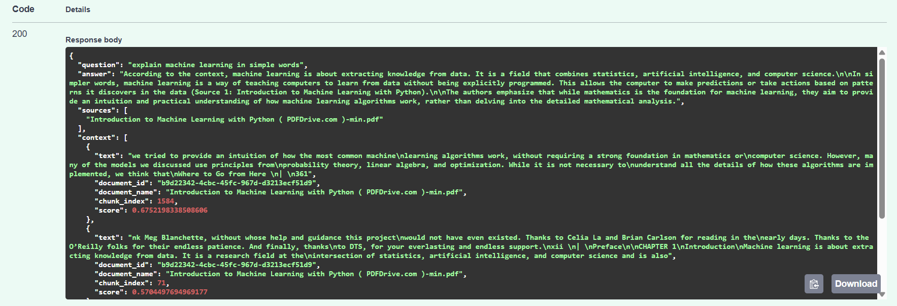

# Semantic Search Bot

A production-style semantic document search and Retrieval-Augmented Generation (RAG) backend built with **FastAPI**, **Sentence Transformers**, **FAISS**, and **Ollama**.

Unlike traditional keyword search, this system retrieves documents based on **semantic meaning** using dense vector embeddings. Users can upload PDFs or text documents, perform semantic search, and ask natural language questions that are answered using retrieved document context.

---

## Overview

Traditional search engines rely on keyword matching. If the wording of a query differs from the wording inside a document, relevant information may never be found.

This project solves that problem by combining:

- **Sentence Transformers** for dense text embeddings
- **FAISS** for efficient vector similarity search
- **Ollama** for local Large Language Model inference
- **Retrieval-Augmented Generation (RAG)** to ground answers in uploaded documents

The result is an end-to-end document intelligence pipeline capable of searching by meaning instead of exact words.

---

## Features

- Upload **TXT**, **Markdown**, and **PDF** documents
- Automatic document parsing and intelligent text chunking
- Dense vector embedding generation using Sentence Transformers
- Semantic similarity search powered by FAISS
- Retrieval-Augmented Question Answering (RAG)
- Local LLM inference using Ollama (no cloud APIs required)
- Persistent vector index and document metadata
- REST API with interactive Swagger documentation

---

## Demo

### Swagger UI




---

### Semantic Search



---

### Retrieval-Augmented Generation




---

# Architecture

```text
                     Upload Document
                            │
                            ▼
                 Extract Text (TXT/PDF)
                            │
                            ▼
                  Intelligent Chunking
                            │
                            ▼
          Sentence Transformer Embeddings
                            │
                            ▼
                     FAISS Vector Index
                            │
            ┌───────────────┴───────────────┐
            │                               │
            ▼                               ▼
     Semantic Search                  User Question
                                            │
                                            ▼
                                  Query Embedding
                                            │
                                            ▼
                                 FAISS Similarity Search
                                            │
                                            ▼
                                Retrieve Top-K Chunks
                                            │
                                            ▼
                           Prompt Construction (Context)
                                            │
                                            ▼
                               Ollama (Llama 3.2)
                                            │
                                            ▼
                                  Grounded Answer
```

---

# End-to-End Pipeline

```text
Upload PDF/TXT
        │
        ▼
Extract Text
        │
        ▼
Chunk Document
        │
        ▼
Generate Embeddings
        │
        ▼
Store in FAISS
        │
──────── Query ────────► Embed Query
                            │
                            ▼
                  Semantic Similarity Search
                            │
                            ▼
                 Retrieve Relevant Chunks
                            │
                            ▼
               Construct Contextual Prompt
                            │
                            ▼
                 Ollama (Retrieval-Augmented Generation)
                            │
                            ▼
                      Generated Answer
```

---

# Tech Stack

| Component | Technology |
|------------|------------|
| Backend | FastAPI |
| Language | Python |
| Embedding Model | sentence-transformers/all-MiniLM-L6-v2 |
| Vector Database | FAISS |
| LLM | Ollama |
| PDF Parsing | PyMuPDF |
| HTTP Client | httpx |
| Configuration | pydantic-settings |

---

# Project Structure

```text
semantic-search-bot/
│
├── app/
│   ├── main.py
│   ├── config.py
│   ├── models.py
│   ├── dependencies.py
│   │
│   ├── routers/
│   │     ├── documents.py
│   │     └── search.py
│   │
│   └── services/
│         ├── chunking.py
│         ├── embeddings.py
│         ├── vector_store.py
│         ├── retrieval.py
│         └── qa.py
│
├── sample_docs/
├── tests/
├── requirements.txt
├── pyproject.toml
├── .env.example
└── README.md
```

---

# API

| Method | Endpoint | Description |
|---------|----------|-------------|
| POST | `/documents/upload` | Upload a document |
| GET | `/documents` | List indexed documents |
| DELETE | `/documents/{id}` | Delete a document |
| POST | `/search` | Semantic document search |
| POST | `/ask` | Retrieval-Augmented Question Answering |
| GET | `/health` | Health check |

Swagger UI:

```
http://localhost:8000/docs
```

---

# Installation

## Clone Repository

```bash
git clone https://github.com/kirtan-bhojani/semantic-search-bot.git

cd semantic-search-bot
```

---

## Create Virtual Environment

Windows

```bash
python -m venv .venv

.venv\Scripts\activate
```

Linux / macOS

```bash
python3 -m venv .venv

source .venv/bin/activate
```

---

## Install Dependencies

```bash
pip install -r requirements.txt
```

---

## Configure Environment

```bash
cp .env.example .env
```

---

## Install Ollama

Download from

https://ollama.com

Pull a model

```bash
ollama pull llama3.2
```

Start Ollama

```bash
ollama serve
```

---

# Run the Application

```bash
uvicorn app.main:app --reload
```

Server

```
http://localhost:8000
```

Swagger

```
http://localhost:8000/docs
```

---

# Example Workflow

## 1. Upload a PDF

```
POST /documents/upload
```

↓

Document is

- Parsed
- Chunked
- Embedded
- Indexed inside FAISS

---

## 2. Semantic Search

```
POST /search
```

Example query

```
How do neural networks learn?
```

Returns

- Relevant chunks
- Similarity scores
- Source document

---

## 3. Ask Questions

```
POST /ask
```

Example

```
Explain supervised learning in simple words.
```

Pipeline

```
Question
        ↓
Embedding
        ↓
FAISS Retrieval
        ↓
Top Context
        ↓
Ollama
        ↓
Grounded Answer
```

---

# Configuration

| Variable | Default |
|------------|----------|
| SSB_EMBEDDING_MODEL | sentence-transformers/all-MiniLM-L6-v2 |
| SSB_OLLAMA_MODEL | llama3.2 |
| SSB_OLLAMA_BASE_URL | http://localhost:11434 |
| SSB_CHUNK_SIZE | 512 |
| SSB_CHUNK_OVERLAP | 64 |
| SSB_VECTOR_STORE_DIR | vector_store_data |
| SSB_MAX_FILE_SIZE_MB | 50 |

---

# Performance

- Supports TXT, Markdown and PDF documents
- Successfully tested on large PDF documents (400+ pages)
- Persistent FAISS vector index
- Embedding model initialized once and reused
- Semantic search remains fast after indexing thousands of chunks

---

# Key Learnings

Building this project provided practical experience with:

- Semantic Search
- Dense Vector Embeddings
- FAISS Similarity Search
- Retrieval-Augmented Generation (RAG)
- FastAPI service-oriented architecture
- Local LLM inference using Ollama
- PDF ingestion and document chunking
- REST API design
- Dependency Injection
- Persistent vector storage

---

# Future Improvements

- Background indexing for large documents
- Streaming LLM responses
- Hybrid search (BM25 + Vector Search)
- Metadata filtering
- Authentication & multi-user support
- Docker deployment
- Kubernetes-ready deployment
- Batch embedding generation on GPU

---

# License

MIT
